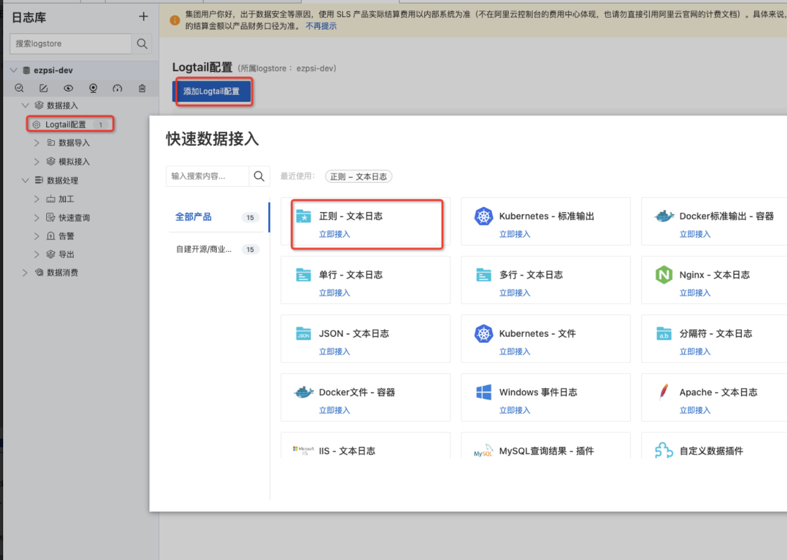
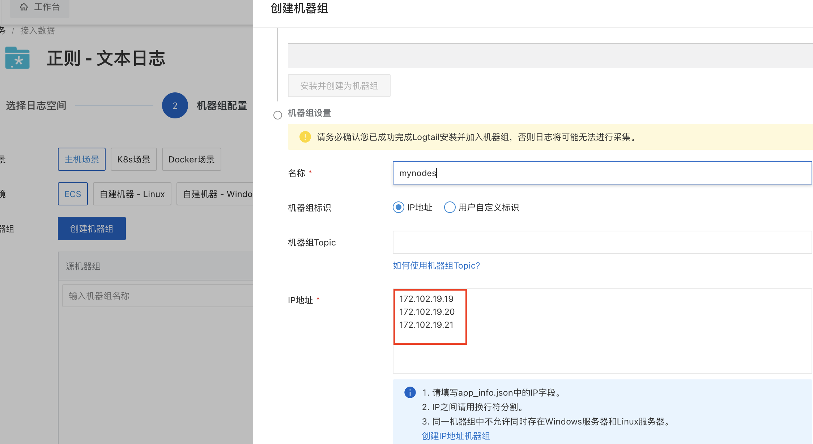
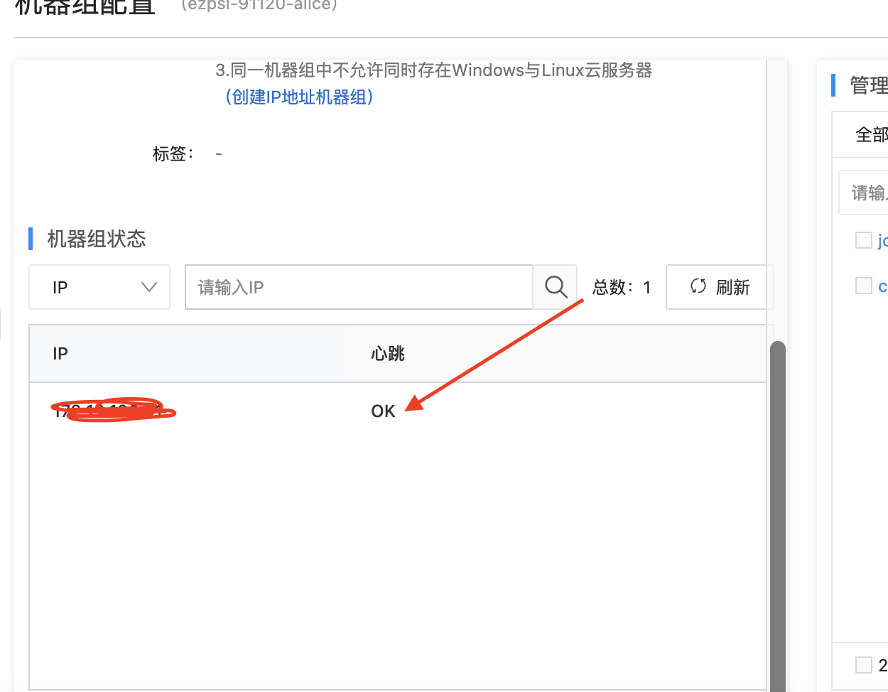
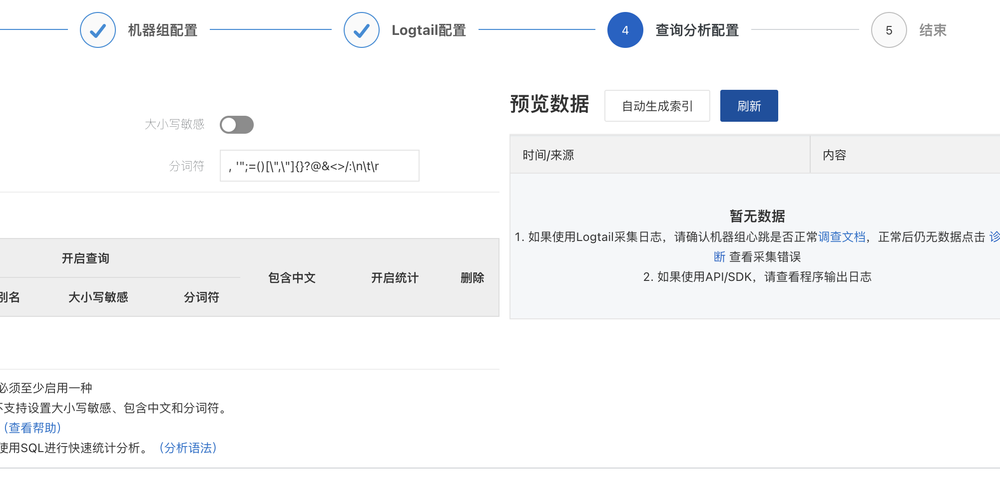
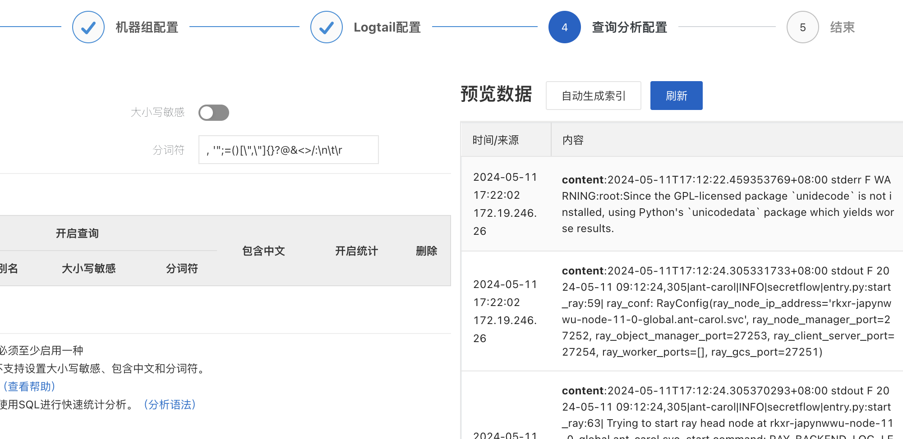
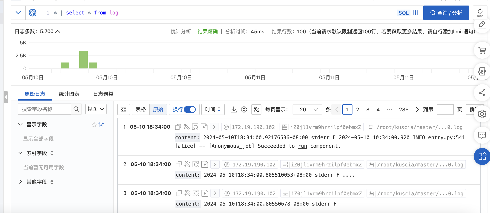
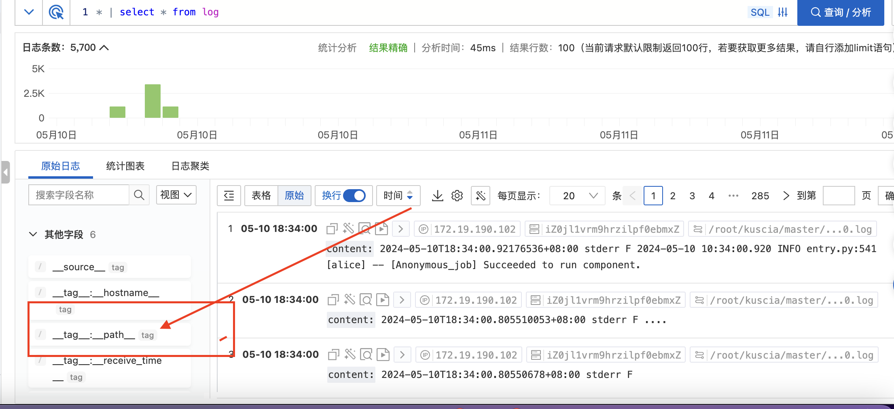
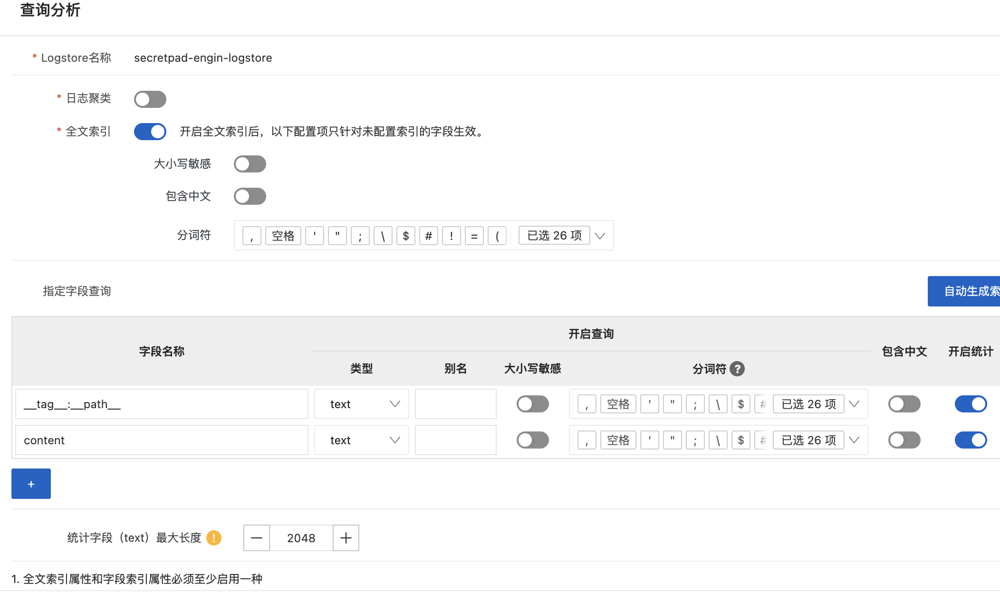

# 阿里云SLS配置说明

## 准备SLS阿里云日志服务实例

SLS阿里云日志服务实例请到阿里云官网搜索SLS日志服务开通
并且准备好账户的AK,SK,HOST这几个必备的参数,在执行install脚本之前需要在bash中export
需要确保这对AK,SK有权限去对SLS进行PROJECT,LOGSTORE的增删改查操作
并且需要确保你Secretpad服务所在的ecs能够有权限访问SLS(ip白名单)

## 在需要采集日志的机器上安装Logtail

* 具体安装步骤可参考 https://help.aliyun.com/zh/sls/user-guide/install/?spm=a2c4g.11186623.0.0.61bea737AN5sRU

## 环境变量准备

在安装我们整个隐私计算环境之前,先要准备好阿里云日志服务的AK,SK,以及HOST.这三个是必选项
export SECRETPAD_CLOUD_LOG_SLS_AK=your SLS AK
export SECRETPAD_CLOUD_LOG_SLS_SK=your SLS SK
export SECRETPAD_CLOUD_LOG_SLS_HOST=your SLS HOST

还有个参数 project 是可选项
export SECRETPAD_CLOUD_LOG_SLS_PROJECT=your SLS project
这个参数如果没有设置,那么我们在启动install.sh的时候,例如(sh install.sh master -P notls)
,系统会为我们在阿里云SLS日志服务上创建默认的project
如果以上两个参数设置了,那么说明你预先已经手动在阿里云SLS日志服务实例上创建好了project,系统去使用就好.系统安装时不会再次创建

logStore不是可选项,由于不同的部署模式下有不同的查询权限,为了方便管控,系统启动会为我们创建好
默认的logStore,按照节点的粒度来创建,每个节点一个logStore

## 按照步骤,创建project

这里注意:如果你在准备阶段,不准备export SECRETPAD_CLOUD_LOG_SLS_PROJECT
那么这里你可以跳过当前步骤,因为系统会为我们创建好
可以直接查看配置logstore部分
1.创建project

创建好project之后,我们在install脚本执行前如果导入SECRETPAD_CLOUD_LOG_SLS_PROJECT这个环境变量
那么系统就会为我们在这个project下去创建各个节点的logStore

## 给logstore配置logtail

选择正则-文本日志

创建机器组

给机器组添加你计算服务所在的ecs的ip地址,可以填写多个

检测心跳

到下一步,logtail配置
点击 '其他全局配置',选择 '文件路径提取',输入 /pods\/([^_]+)_.*\.log$
文件采集路径,以中心化模式为例,/root/kuscia/master/alice/pods,其他autonomy模式可以自行修改
最大目录深度可以选择4

添加日志样例,以及选择多行模式,配置完成后左上角点击保存
2024-04-17T14:08:12.448790407+08:00 stderr F WARNING:root:Since the GPL-licensed package `unidecode` is not installed,
using Python's `unicodedata` package which yields worse results.

配置完成以后到数据探测阶段,如果这里探测不到数据,可以去Secretpad平台侧重新跑一个任务,再重新刷新探测

跑任务以后,应该会有新的数据上来,说明logtail采集数据成功

这时候可以点击自动生成索引,这样日志当前项目就会把索引自动开启,后续我们可以添加索引

等待约一两分钟,如果你所有的配置都正确,并且服务器上有日志产生,那么此时在阿里云SLS控制台查询的话应该可以查到原始日志

此时我们Secretpad平台还不能查询到这些日志,因为我们平台查询的日志是分析日志,所以需要在这里开启索引
点击'其他字段'可以看到6个字段,选择'__tag__:__path__'字段

选中它,点击右边的'索引'按钮,然后点击'确定'

点击'+'号

输入 __tag__:__path__  作为索引名称 ,点击确定

如果添加成功,可以看到索引字段新增了一个索引,就是我们添加的这个

同时将content字段也添加索引,这也是必须的配置项,这时我们可以看到两个索引字段
如果没有成功配置索引,我们Secretpad平台侧查询会失败,提示类似于:"获取云端日志失败: line 1:8: Column 'content' cannot be
resolved;please add the column in the index attribute;please add the column in the index attribute"

此时再此在控制台输入查询命令 * | select * from log
会发现多了统计信息以及我们添加的索引字段 __tag__:__path__
到这里我们设置全部完成

我们在Secretpad平台上重新跑一个任务,就能看到所有的日志了

## install脚本安装成功后如何检查Secretpad平台侧有没有成功加载SLS服务

我们可以进Secretpad容器
docker exec --it root-kuscia-master-secretpad bash
cd log
cat secretpad.log
如果成功加载了SLS服务,那么有一行日志会体现说明安装成功:Detected that the cloud service has been configured,create cloud
service instance
如果加载SLS功能失败,也会有对应的日志,根据具体信息排查
